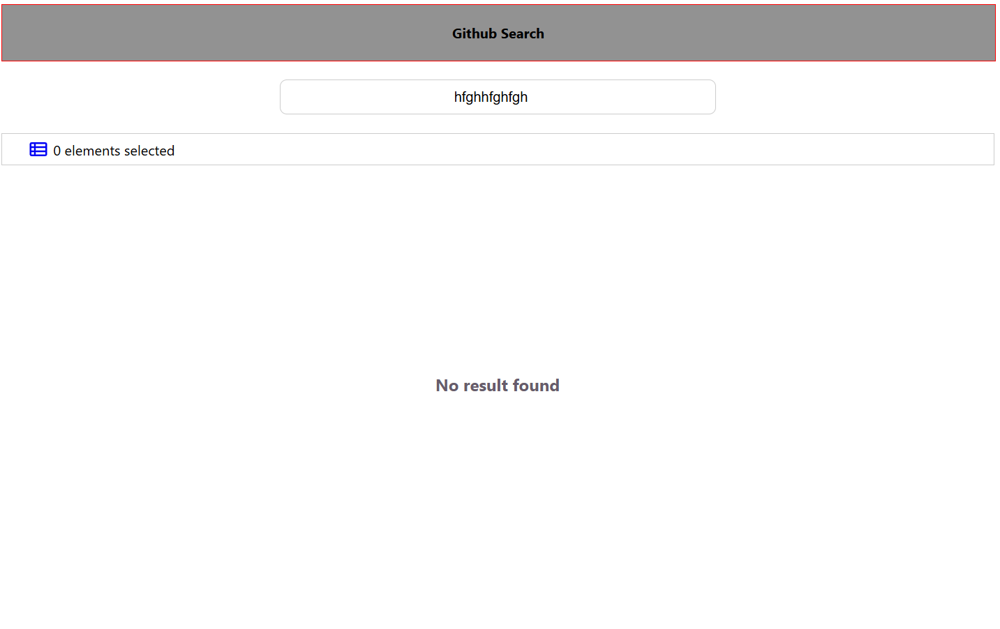
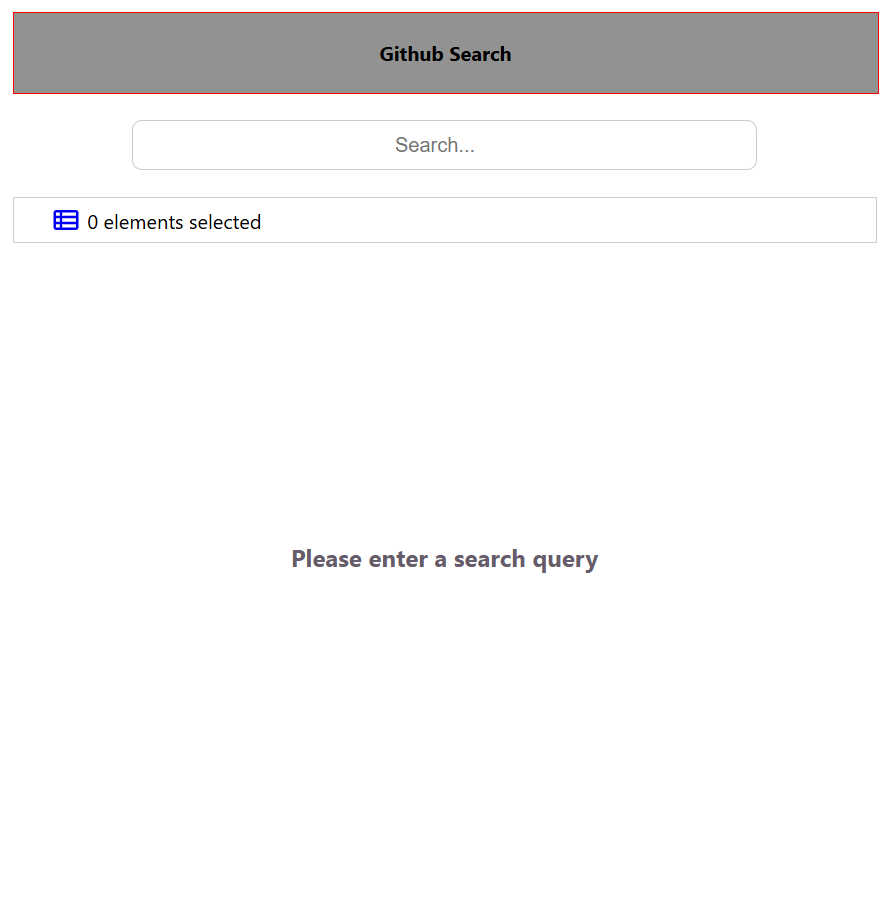
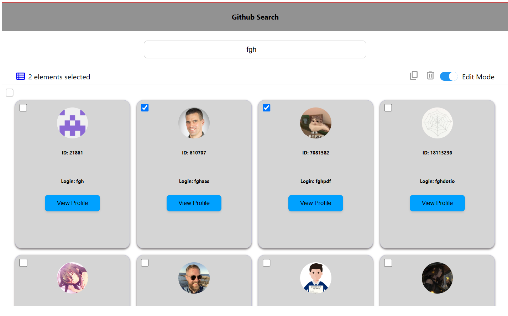

# 👤 GitHub User Search – Fulll Technical Exercise

A React + TypeScript application to search for GitHub users, display user cards, allow multi-selection with duplicate/delete actions, and provide a clean, responsive UI.

---

## 🔍 Features

- Search for GitHub users using the public API https://api.github.com/search/users?q={USER}.
- Display results as user cards
- Multi-select user cards (edit mode)
- Duplicate and delete selected users
- Fully responsive layout (1–4 columns depending on screen size)
- Built with **Create React App (CRA)** and **TypeScript**
- Unit tests with **Jest** and **React Testing Library**
- No external state management libraries (e.g., Redux)

## 🧱 Project Structure

src/
├── components/
│ ├── UsersList/
│ │ ├── UserCard/
│ │ ├── ListControls/
│ │ └── Search/
│ └── Header/
├── utils/
├── types/
├── Constants.ts
├── App.tsx
└── index.tsx

## 🛠 Tech Stack

- **React** 19.1
- **TypeScript**
- **Jest** + **React Testing Library**
- **Create React App**
- CSS Modules (no external UI libraries)

---

## 📦 Installation

# Clone the repository

git clone https://github.com/your-username/user_search_fulll.git
cd user_search_fulll

# Install dependencies

npm install

# Running the App

npm start
The app will be available at http://localhost:3000.

# Run all tests

npm test

# Run with coverage

npm test -- --coverage

# How the Application Works :Search , Selection, Edit Mode, and Action Buttons

# Search

Type a keyword into the search bar.
The app fetches matching GitHub users and displays them as cards.
If no users are found, a message appears: "No results found."
If the GitHub API rate limit is reached, an error appears:
"GitHub request limit reached. Please try again in a minute."

# Edit Mode

A toggle switch enables or disables edit mode.
When edit mode is active, checkboxes appear on each user card to allow user selection.

# User Selection

Users can be selected individually via the checkboxes.
A "Select All" checkbox appears when users are loaded and edit mode is active. It allows selecting or deselecting all users at once.

# Duplicate Button

This button duplicates all currently selected user cards.

# Delete Button

This button removes all currently selected user cards from the list.

# Selection Indicator

The number of selected users is displayed dynamically next to the controls, shown as:
“X elements selected”.

# Screenshots

case No results

case with results

case no search value taped

case edit Mode

